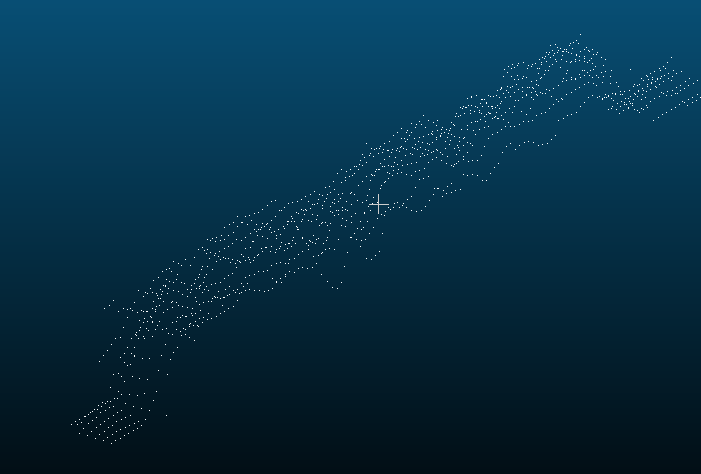
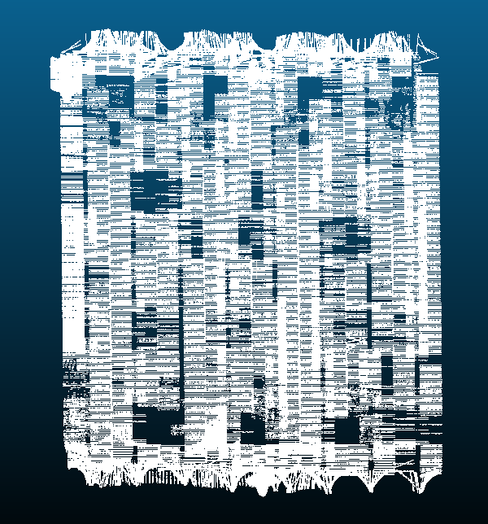
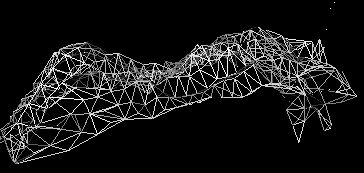

# The Cotton Lidar Project

  Please note that most of the projects contained in this repository are dependent on the repository “anfrench/pcllib” as well as the point cloud library. Clone the anfrench/pcllib [here](https://github.com/anfrench/pcllib) and download/install the [point_cloud_library](http://pointclouds.org/downloads/).

  To compile the code (as is) make a directory called “pclLib” in the same folder as the source code and clone the pcllib to that directory. Otherwise make sure to edit the #includes appropriately so that the compiler can find where you put the necessary files.

## Purpose

  The Cotton Lidar Project is a set programs designed to implement lidar in high throughput phenotyping. These projects were originally wrote for use with canton plants. However, could be used for other applications.

## Projects

* AccuRange
  * Creating a microcontroler to get and log data from an AccuRange lidar unit.

Status: Active

* ### Boll Counts
  * Uses input parameters to cluster Point clouds and count the clusters.
  
  status: IDLE
* ### Canopy / Canopy ARC
  * Indexes each point of a cloud to a grid and creates a point cloud or prints the highest points to a csv file.
  * 
  
  Status: Active

      Added Method to generate the floor of a point cloud.
      Working on polynomial fitting to estimate points at any location.

* ### Cloud merger
  * Using a list of files names, combines all point clouds into one.
  * 
  
  Status: IDLE

* ### Clustering Tests
  * Clusters a file and replaces the clusters with spheres of random colors. each cluster retains its location, approximate size, and approximate points.
  * 

Status: IDLE

* ### Cluster Placement
  * Clusters cloud and replaces the clusters with a single point.

Status: IDLE

* ### Convex hull
  * Creates a canopy for the cloud, fills gaps, and does a quick triangulation to create a convex hull.
  * 
  
  Status: IDLE

* ### Height and Width
  * Finds the widths of a point cloud using slices of the point cloud at different heights.
  
Status: IDLE

* ### LidarGPS
  * Excess Removal
    * Removes white space, extra newlines, and time stamps from lms400 data.
  * GPS Data
    * Contains classes to process GPS data.
  * Lidar GPS to PCD
    * A program to merge strings of GPS data and LMS 511 data to create a point cloud.
    * 
    * 

Status: Active

    Rencent changes:
      A XY shift can now be added to the gps.
      Now have the option to ignore points out of bounds.
      All file names are set in the config file.
      Normals are now created being created using the lidar angle.
      Height is now being pulled from gps strings.

* ### LMS Decoders
  * Contains classes to process LMS511, and LMS400.
  
  Status: Active
  
      Changes are being made to make all Lidar units we have usable with the lidar/GPS to pcd Program.
      Making class for AccuRange Lidar.

* ### Normal Estimation
  * Estimates the normals of a point cloud and creates a sphere to display the normal distrobution.
  * 

Status: IDLE

* ### PCD Maker
  * Makes PCD files of simple structures. Was used for testing methods from pclLib/pclMaker.
  * 

Status: Active

    Adding methods to create unique shapes to test other programs.

* ### Plot Heights
  * Using a file of file names and a file containing a series of cropping instructions, finds average heights and writes a CSV file.

  Status: Active
  
      Adding methods to create both floor and Canopy to find the difference rather than absolute height of the points.
      Most current work/changes are being done in canopy.h.

* ### Point Cloud Editor
  * A terminal based program that has several functions to allow you to open and edit point clouds.

Status: IDLE

* ### Smoothing
  * A sample program from the [pointClouds.org](http://pointclouds.org/documentation/tutorials/resampling.php#moving-least-squares) used to smooth point clouds.

Status: IDLE

* ### Turn Table
  * Takes a file of new line delaminated LMS400 scans and projects them onto a rotating z axis.
  * 
  * Making a Point cloud with Photo scan
  * 
  
Status: Active

    Next Steps:
      Using a camera to capture the plant at many angles.
      Using photo scan to create point cloud.
      merging lidar point cloud and photo scan point cloud.
      Filtering points.
      Vectorising plant.