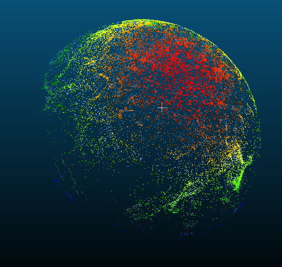
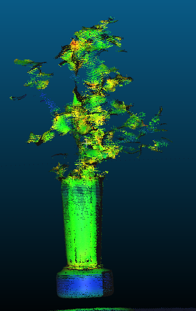

# The Cotton Lidar Project

  Please note that most of the projects contained in this repository are dependent on the repository “anfrench/pcllib” as well as the point cloud library. Clone the anfrench/pcllib here and download/install the [point_cloud_library](http://pointclouds.org/downloads/).

  To compile the code (as is) make a directory called “pclLib” in the same folder as the source code and clone the pcllib to that directory. Otherwise make sure to edit the #includes appropriately so that the compiler can find where you put the necessary files.

## Purpose
  The Cotton Lidar Project is a set programs designed to implement lidar in high throughput phenotyping. These projects were originally wrote for use with canton plants. However, could be used for other applications.

## Projects

* ### Boll Counts
  * Uses input parameters to cluster Point clouds and count the clusters.
* ### Canopy ARC
  * Indexes each point of a cloud to a grid and prints the highest points to a csv file.
  
* ### Normal Estimation
  * Estimates the normals of a point cloud and creates a sphere to display the normal distrobution.
   
* ### Point Cloud Editor
  * A terminal based program that has several functions to allow you to open and edit point clouds.
* ### Turn Table
  * Takes a file of new line delaminated LMS400 scans and projects them onto a rotating z axis.
   
* ### Cloud merger
  * Using a list of files names, combines all point clouds into one.
   
* ### Cluster Placement
  * Clusters cloud and replaces the clusters with a single point.
* ### Clustering Tests
  * Clusters a file and replaces the clusters with spheres of random colors. each cluster retains its location, approximate size, and approximate points.
   
* ### Convex hull
  * Creates a canopy for the cloud, fills gaps, and does a quick triangulation to create a convex hull.
  
* ### Height and Width
  * Finds the widths of a point cloud using slices of the point cloud at different heights.
* ### PCD Maker
  * Makes PCD files of simple structures. Was used for testing methods from pclLib/pclMaker.
* ### Plot Heights
  * Using a file of file names and a file containing a series of cropping instructions, finds average heights and writes a CSV file.
* ### Smoothing
  * A sample program from the [pointClouds.org](http://pointclouds.org/documentation/tutorials/resampling.php#moving-least-squares) used to smooth point clouds. 
* ### Z-Sick Decoder
  * Excess Removal
    * Removes white space, extra newlines, and time stamps from lms400 data.
  * LMS400 Data
    * Contains classes to process LMS400 lidar data.
  * LMS 511
    * A program to merge strings of GPS data and LMS 511 data to create a point cloud.
      